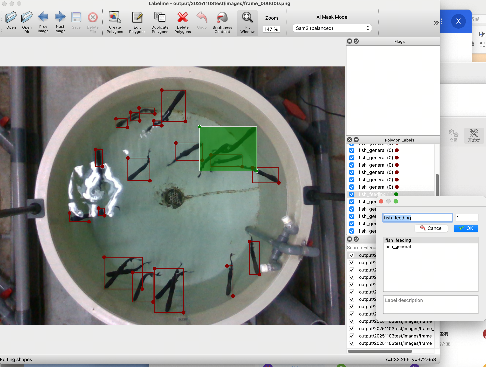

# Bag数据文件处理&标注

将 ROS bag 数据批量转换为帧图像和 MP4 视频，并提供基于 OpenCV 的预标注与 Labelme 微调辅助工具链。

```
git clone git@github.com:xinyiqin/bag_file_process.git
cd bag_file_process
```


## 1.首次运行
### 先安装docker
https://www.docker.com/products/docker-desktop

```
docker --version
```
### 拉取镜像
```
docker pull osrf/ros:noetic-desktop-full
```

### 运行镜像
```
docker run -it --name "bag_process" -v F:/intel:/workspace osrf/ros:noetic-desktop-full
```

### 换源
```
sed -i 's|http://archive.ubuntu.com/ubuntu/|https://mirrors.tuna.tsinghua.edu.cn/ubuntu/|g' /etc/apt/sources.list
```

### 安装依赖
```
apt-get update -qq && apt-get install -y -qq python3-pip ffmpeg > /dev/null 2>&1 && pip3 install opencv-python numpy
```

### 切换目录到workspace
```
cd workspace
```

### 运行python代码，BAG_FILE和OUTPUT_DIR换成你的
```
python3 /code/bag_to_video.py /$BAG_FILE -o /workspace/$OUTPUT_DIR
```

例子：
```
python3 /code/bag_to_video.py /bag_files/20251103test.bag -o /output
```

脚本会在输出目录下生成 `images/frame_000000.png` 等图像帧，再合成 `output.mp4`。

---

## 2.后续运行

### 进入container
```
docker start -ai bag_process
```

### 运行python代码，BAG_FILE和OUTPUT_DIR换成你的
```
python3 code/bag_to_video.py $BAG_FILE -o $OUTPUT_DIR
```

### 一次性处理目录下所有 .bag 文件，DIR_BAG_FILES换成存放很多bag文件的目录，例如/bag_files，OUTPUT_DIR是输出目录
```
python3 code/bag_to_video.py --batch $DIR_BAG_FILES -o $OUTPUT_DIR
```

例子：
```
python3 code/bag_to_video.py --batch bag_files -o output
```

---

## 3.通过opencv的轮廓检测进行预标注
(不在docker里了，在外面的终端运行)

$DATA_DIR换成上面output文件夹下的具体数据文件夹
```
python code/pre_label.py $DATA_DIR
```
例子：
```
python code/pre_label.py output/20251103test
```

---

## 3.labelme标注
### 安装labelme
```
pip install labelme
```

### 开始标注，IMAGE_DIR换成images文件夹，LABELME_DIR换成上面预标注里的labelme文件夹
```
labelme $IMAGE_DIR  --output $LABELME_DIR
```

例子：
```
labelme output/20251103test/images --output output/20251103test/labelme
```

### 在labelme中进行修改，添加新的状态比如fish_feeding,group_id设置为1

---

## 4.转回yolo格式并可视化
```
python code/labelme_to_yolo.py $DATA_DIR
```

例子：
```
python code/labelme_to_yolo.py output/20251103test
```